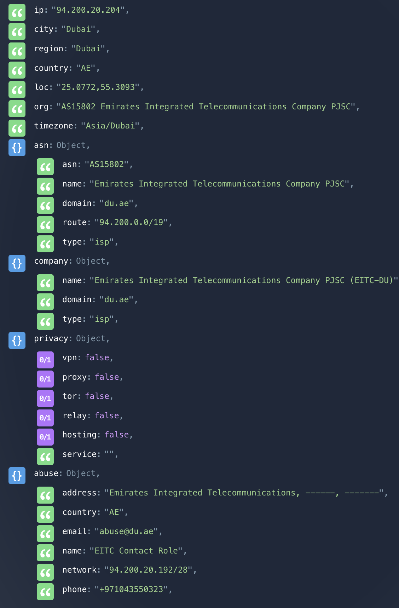
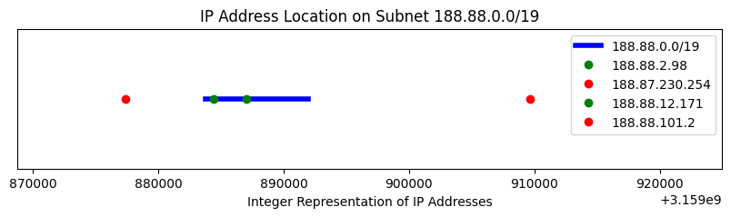
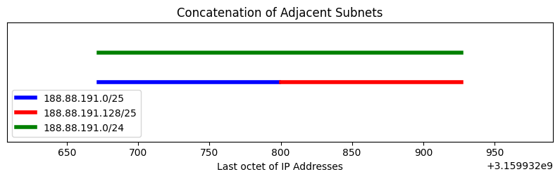
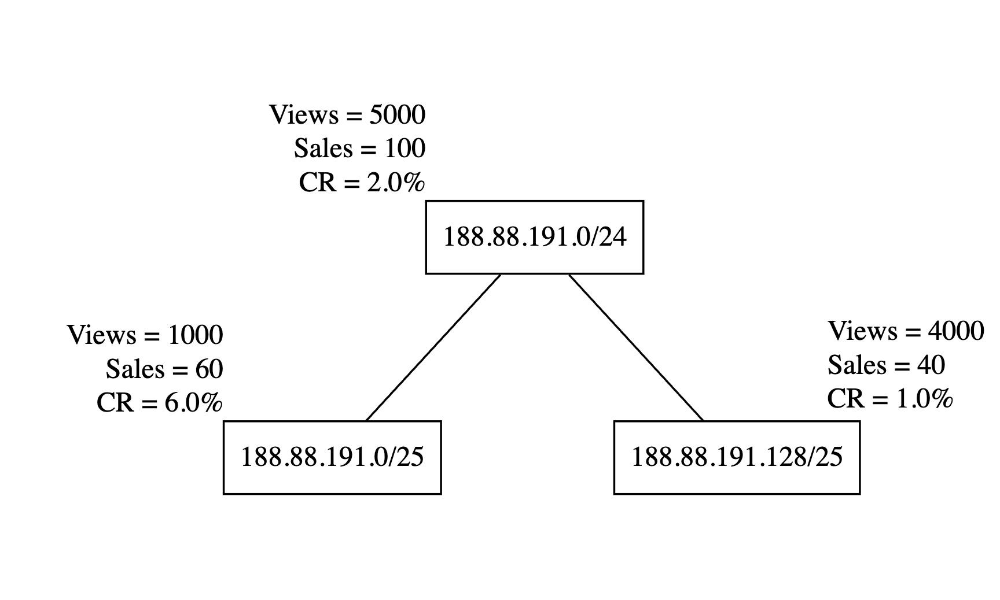
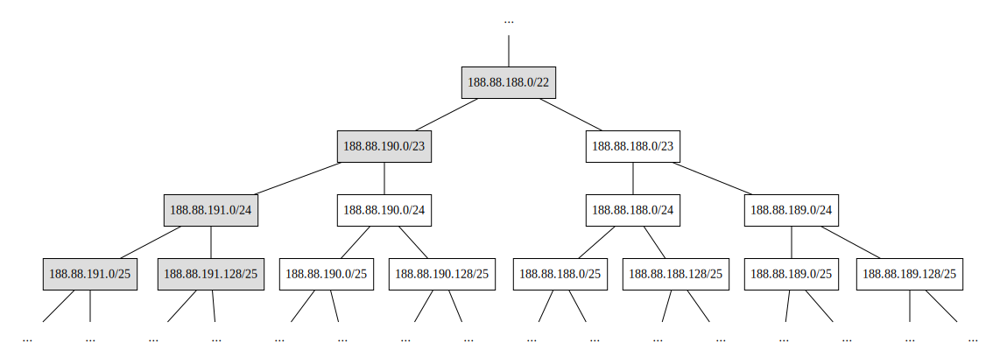
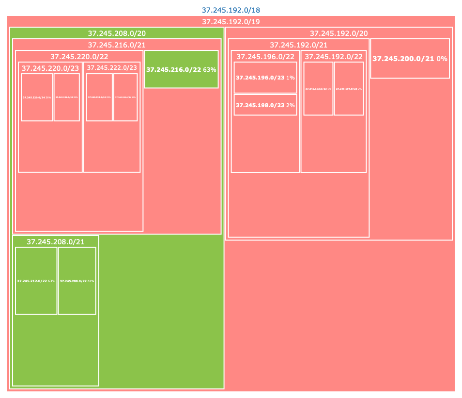

<style
  type="text/css">
section.lead.large h1 {
  font-size: 200%
}
/* section.answer > * {
  display: none !important;
}

section.answer > div {
  display: none;
}

section.answer::before {
  content: 'ANSWER DURING THE SHOW';
  color: silver;
  z-index: 10000;
  font-size: 60pt;
  display: block !important;
  transform: translate(40pt, 160pt) rotate(30deg);
} */
</style>

# Agenda

<!-- We are going to spend most of our time today on IP ranges -->

- Basics of IP addresses
- IP Location
- IP Families (v4 and v6)
- IP Ranges
- Analyzing KPIs for IP Ranges

---

<!-- _class: lead large -->
# Interrupt
# Ask questions

---

<!-- _class: lead large -->
# Non-Hierarchical Data Structures

<!-- Most of the data that we deal with every day is not very hierarchical. Some examples: -->

---


---

<!-- A bit of hierarchy: You might think ARPU of Month 3 includes ARPU of Month 2 -->


---

<!-- _class: lead large -->
## IP Ranges Form a Hierarchical Data Structure

- Parent and children
- Each child can also be a parent of other children
- Top-most parent _(singular)_
- Bottom-most children
- Infinite hierarchies

---

# IPs

<!-- What is an IP to begin with? -->


Each device connected to a network has a unique IP address in that network. 

IPs are like unique addresses or post codes. If you want to send a message to another device, you need to know its IP address.   


---

<!-- _class: lead large -->
# My IP

Let’s check your IPs. Go to https://ipinfo.io/


---


<!-- _class: lead large -->

# Why do devices that are connected to the same WIFI have the same _public_ IP address❓

---


---

<!-- _class: lead -->
## Why devices that are connected to the same WIFI have the same IP address?
  - This is the IP address of your router. Your router is actually the device that is connected to the internet. Your laptop or phone is connected to the router.
      - Your device has a local IP. How to check it?
---


In Mac, hold option (alt) key and mouse over the wifi icon in the status bar

---

<!--class: not-lead -->

### Summary of Routers

Your _prviate IP_ is only meaninful in your local network (home, office, etc).

Local network is behind a router.

Router is the device that is actually connected to the internet.

Private IPs are separate and distinct classes from public IPs. They cannot be confused.

_Here in these slides we only deal with public IPs._

---

<!-- _class: not-lead -->


Now turn off wifi on your phone, connect to cellular data and check https://ipinfo.io/
- Even if you use the same carrier, you will (very very likely) have unique IPs

---

In short:
  - If you’re connected to a router, you share your public IP address with all the other devices that are connected to the router.
  - If you’re connected to cellular data (directly to the internet) you own your public IP at that moment.

---
<!-- _class: not-lead -->

IPs can reveal your identity or a lot more about you.
  - For example anybody can check which torrent files have been downloaded by an IP
  - Check my neighbour’s downloads: https://iknowwhatyoudownload.com/en/peer/?ip=188.88.125.171

---

Back to [ipinfo.io](http://ipinfo.io) you can see that IPs also reveal your geo location.

<!-- _class: lead large -->
# How does IP geo location work❓


---

<!-- _class: lead large answer -->

## How does GPS work?


---

<!-- _class: not-lead answer -->
Similar to GPS, they have many servers located around the world and they measure how many milliseconds it takes to reach the destination IP from each server. And then triangulate. 

```bash
$ traceroute 27.131.50.162 
traceroute to 27.131.50.162 (27.131.50.162), 64 hops max, 52 byte packets
 1  home (192.168.1.1)  8.949 ms  2.268 ms  2.280 ms
 2  188.88.16.1 (188.88.16.1)  9.665 ms  10.152 ms  9.644 ms
 3  10.226.4.80 (10.226.4.80)  12.597 ms  12.266 ms  12.133 ms
...
11  ae-7.r23.kslrml02.my.bb.gin.ntt.net (129.250.2.169)  264.502 ms  265.421 ms  366.512 ms
12  ae-2.r00.kslrml02.my.bb.gin.ntt.net (129.250.3.230)  322.198 ms  295.339 ms  259.989 ms
13  ae-1.maxis.kslrml02.my.bb.gin.ntt.net (203.78.193.238)  352.552 ms  265.134 ms
```
2ms to reach my router
352ms to reach Maxis Fibre

---

# IP v4 and v6

There are two family of IPs. Version 4 and version 6. 
What happened to versions 1, 2, 3 and 5? Check Wikipedia.

IPv4: `188.88.16.1`

IPv4: `188.088.016.001`

IPv6: `2001:8f8:1f26:0:800:f66c:9a2f:6913` 

IPv6: `2001:8f8:1f26:0000:0800:f66c:9a2f:6913` 

---

### Shorthand notations for IPv6
    
  IPv6: `2001:8f8:1f26:0000:0800:0000:0000:0000` 

  IPv6: `2001:8f8:1f26:0:800::`
$-------$

  IPv6: `2001:8f8:1f26:0000:0800:0000:0000:6913` 

  IPv6: `2001:8f8:1f26:0:800::6913`
$-------$

  - Replace blocks of `0`s with `::`

---

## Challenges with IPv6

- IPv6 network is not compatible with IPv4
- All devices are compatible with IPv4
- If your device has IPv6, you cannot just communicate with IPv4 devices
  - There are a few ~~hacks~~ solutions that are complicated

## Opportunities with IPv6
- ❓

---

<style scoped>
  a { text-decoration: none; }
</style>

[IPv6 Adoptation](https://www.google.com/intl/en/ipv6/statistics.html#tab=per-country-ipv6-adoption)


---


---

# IPs are numbers

`0.0.0.0` = `0`
`0.0.0.1` = `1`
...
`188.88.16.1` = `3,159,887,873`
...
`255.255.255.255` = `4,294,967,295`

Therefore they can be sorted from smallest to biggest. We can also create _ranges_ (all IPs between two IPs ~ All numbers between two numbers).

---

# IPv6s are also numbers

`::0` = `0`
`::1` = `1`
...
`::ffff` = `65535`
...
`2001:8f8:1f26:0:800:f66c:9a2f:6913` = `42,540,670,079,476,949,997,653,255,939,924,388,115`
...


Therefore they can be sorted from smallest to biggest. We can also create _ranges_ (all IPs between two IPs).


---

How exactly can we convert an IP address to a number? -> Math session.

The first IPv4:
`0.0.0.0` = `0` 

The last IPv4: 
`255.255.255.255` = `4,294,967,295` = `4,294,967,296 - 1`

- Where does `4,294,967,296 - 1`  come from?

  
$$
2^{32}-1
$$

---

$$
2^{32}-1 = 4,294,967,296 - 1
$$

- Why 2 ?

<!-- 32 bits = four bytes -->
- Why to the power of 32?

<!-- Because in computers numbers start from 0 not 1 -->
- Why minus one?

$- - - - - - - - -$

- Math session!

---

Four billion is much smaller than the population of the earth. And these days each person has more than one device connected to the internet. 
We needed more IP addresses than what IPv4 space can provide.

Hence IPv6
       
The last IPv6: 
`ffff:ffff:ffff:ffff:ffff:ffff:ffff:ffff`  = `340,282,366,920,938,463,463,374,607,431,768,211,455`
        
$$
2^{128}-1
$$

---

<!-- _class: lead large -->
# IP Ranges
---

<!-- _class: lead large -->

## IP Ranges

- IPs are numbers, the same way that you can speak about all the numbers between `32` and `47`, you can also speak about all IPs between `0.0.0.32` and `0.0.0.47`.

- How many IPs are in this range❓
  - `0.0.0.32` and `0.0.0.47`

---

<!-- _class: answer -->

## IP Ranges

- IPs are numbers, the same way that you can speak about all the numbers between `32` and `47`, you can also speak about all IPs between `0.0.0.32` and `0.0.0.47`.

- How many IPs are in this range❓
  - `0.0.0.32` and `0.0.0.47`

  &nbsp;
  - $47 - 32 + 1 = 16$


---

## IP Ranges

Because there are many IPs, we usually don’t analyze individual IP addresses. We group them into ranges or networks.
  - Example of a range:
  `188.88.16.0 ... 188.88.16.255`
  &nbsp;
  - How many individual IPs are in this range❓

---

## CIDR notation

`188.88.16.0 ... 188.88.16.255` can be represented with a network CIDR notation: 
`188.88.16.0/24`

- `Network Interface IP / Prefix`
  
- Prefix
  - For IPv4 Prefix is a number between 0 and 32
  - For IPv6 Prefix is a number between 0 and 128
  - Indicates the size of the network

<!-- _footer: Classless Inter-Domain Routing -->

---

<!-- _class: lead -->
# CIDR = Subnet = Network = Netblock ≈ IP Range

---

## CIDR Prefix

Prefix indicates the size of the network.

Number of IP addresses in this range `188.88.16.0/24`:

$$
2^{\ 32 \ - \ 24} = 2^{8} = 256
$$

- In the math session
  - Why do we subtract the prefix from 32?
  - Why is it called prefix while it is written after the IP address?

---

## CIDRs are a set of IPs (they contain IPs)

`188.88.16.35` is inside (belongs to) to this network: `188.88.16.0/24`

`98.1.221.2` is outside (does not belongs to) to this network: `188.88.16.0/24`

$$
\begin{aligned}
\text{188.88.16.35} \in \text{188.88.16.0/24}

\\

\text{98.1.221.2} \notin \text{188.88.16.0/24}

\end{aligned}
$$

---

<!-- _class: lead -->
# Exercise: How many IPs are in this network❓ `188.88.0.0/19`
    
---

<!-- _class: lead answer -->

# ✅ Exercise: How many IPs are in this network❓ `188.88.0.0/19`


&nbsp;
&nbsp;

$$
2^{\ 32 \ - \ 19} = 2^{13} = 8192
$$

---

# Which of these IP addresses do not belong to this network `188.88.0.0/19`❓

1. `188.88.2.98` 
1. `188.81.255.254` 
1. `188.88.12.171`
1. `188.88.191.2`

---

<!-- _class: answer -->

✅ CIDR block `188.88.0.0/19` represents IP addresses 
`from 188.88.0.0 to 188.88.31.255`
(8192 IPs after 188.88.0.0)

| IP Address       | $\le$ | Integer Representation    | $\le$ |
|------------------|-------|---------------------------|-------|
| 188.88.0.0/19    | 3159883776     |  ...  | 3159891967     |
| 188.88.2.98      | ✅  | 3159884386                | ✅  |
| 188.81.255.254   | ✅  | 3159490558                | ❌ |
| 188.88.12.171    | ✅  | 3159887019                | ✅  |
| 188.88.191.2     | ❌ | 3159932674                | ✅  |


---

We often cannot tell if an IP belongs to a CIDR by just checking its digits. We need to do the math.

$$
\begin{aligned}
\text{188.81.255.254} \notin \text{188.88.0.0/19}
\\
\text{188.88.191.2} \notin \text{188.88.0.0/19}
\end{aligned}
$$

- [Python code](https://glot.io/snippets/guptwcmwdj) [Postgres code](https://tau.sam-media.com/editor/313/version/3)



---

CIDR notation is a very efficient way of representing a range. Because we immediately know the size of the range.

```
a.b.c.d/17
```

IP range size (network size) = $2^{32 - 17} = 2^{15}$

&nbsp;

## What is the largest possible IPv4 range (largest IPv4 CIDR)❓

---

<!-- _class: answer -->

# Largest CIDR

- What is the largest possible IPv4 range?
    - `0.0.0.0/0`
        
        $$
        2^{\ 32 \ - \ 0} = 2^{32}
        $$
        
    - Every IPv4 address belongs to this range / network / CIDR: `0.0.0.0/0`

---

# Smallest CIDR

What is the smallest IPv4 range❓

---

<!-- _class: answer -->

# Smallest CIDR

What is the smallest IPv4 range❓
- `188.88.36.21/32`
- `a.b.c.d/32`

    $$
    2^{\ 32 \ - \ 32} = 2^{0} = 1
    $$

---

# Adjacent ranges

We can concatenate two neighboring ranges together to build a bigger range (_sometimes_):
`188.88.191.0/25` and `188.88.191.128/25`
    
Can be combined into `188.88.191.0/24`



---

- What is the size of `188.88.191.0/25` and `188.88.191.128/25` ?
    *  $2^{32 - 25} = 2^7 = 128$

- What is the size of `188.88.191.0/24` ?
    * $\begin{aligned}2^{32 - 24} = 2^8 &= 256 \
    \\
    &= 2 \times 128\end{aligned}$


* Because `188.88.191.0/24` is made of concatinating 
  - `188.88.191.0/25`
  - `188.88.191.128/25`
---

## CIDRs are made of CIDRs


- We can say that `188.88.191.0/24` contains
  - `188.88.191.0/25`
  - `188.88.191.128/25`

- Or `188.88.191.0/24` is the parent of
  - `188.88.191.0/25`
  - `188.88.191.128/25`

---


---

## :question:


---

## ✅ 

<!-- _class: answer -->



---

<style scoped>
section {
  padding-top: 0;
  position:relative;
  background-color: white;
}
section p > img {
  position: relative;
  top: -65px;
}
ul:nth-child(2) {
  position: relative;
  top: -160px;
}
</style>


- If our threshold CR is greater than or equal to 2.0% we can continue targeting `188.88.191.0/24`.
- If our threshold CR is greater than or equal to 4.0%, then we must exclude `188.88.191.125/25`.

---

Google IP exclusion has a limit of 500 entries. This method of concatenating sibling ranges is one way that we can save some entries.

| Child Ranges              | Merged (Parent) Range       |
|------------------------------|--------------------|
| ... | ... |
| `188.88.191.0/25`, `188.88.191.128/25` | `188.88.191.0/24` |
| `188.88.191.0/24`, `188.88.191.1/24`   | `188.88.190.0/23` |
| `188.88.190.0/23`, `188.88.188.0/23`   | `188.88.188.0/22` |
| ... | ... |

---

## Visually 


---
## In fact it is a tree!



---


So when you are targeting or excluding `188.88.188.0/22`, you don’t need to include the smaller ranges that are contained in this bigger range.


---

## Exercise ❓


---

Let's analyze this!

**Target CR: minimum 1%**


---

**Target CR: minimum 1%**


---

## Fraud? :warning:


---

Should we exclude 
`64.0.0.0/2`:question:


---

Nodes with 0 views


---

0 Views
Missing nodes 
Missing data


---

Another example
`0.0.0.0/2` group 


---


Should we exclude
`128.0.0.0/1` :question:


---

CIDRs form a binary tree. Each parent has exactly two children.

| Left Child | Right Child | Parent                          |
|------------|-------------|---------------------------------|
| ✅         | ✅          | ✅                              |
| ❌         | ❌          | ❌                              |
| ✅         | ❌          | ✅ or ❌ (depending)    |
| ❌         | ✅          | ✅ or ❌ (depending)   |
| ✅         | Missing          | ❓                              |
| Missing         | ✅          | ❓                              |

- Why may some nodes be missing from the data?

---

# IP ranges (CIDRs) form a tree


---

<!-- _class: lead large -->
# Treemap representation

&nbsp;

---
<style scoped>
section.right-text p {
  max-width: 100%;
  flot: right;
  margin-left: 60%;
}
</style>

<!-- _class: right-text -->
Analyzing HE ratre


---


---

<style scoped>
section.right-text p {
  max-width: 100%;
  flot: right;
  margin-left: 60%;
}
</style>

<!-- _class: right-text -->
HE $\ge$ 40% -> Green


---
<style scoped>
section p {
  font-size: smaller;
}
</style>

Treemap representation is 
equivalent




---

<style scoped>
section.right-text p {
  max-width: 100%;
  flot: right;
  margin-left: 50%;
}
</style>

<!-- _class: right-text -->
Left side of the tree is easy.
All the nodes have less than 40% HE rate.


---

<style scoped>
section.left-text p:nth-child(1) {
  max-width: 30%;
  float: right;
}
section.left-text p:nth-child(2) {
  max-width: 28%;
}
section.left-text p:nth-child(3) {
  max-width: 40%;
}
section.left-text p:nth-child(4) {
  max-width: 40%;
  margin-top: 3em;
}
</style>

<!-- _class: left-text -->

Right side is more complex

`37.245.208.0/20` has more than 40% HE rate

But one of its children has less than 40% HE.

`37.245.216.0/21` is the opposite, one of its children has 63% HE.


---

<style scoped>
section.right-text p:nth-child(1) {
  max-width: 100%;
  flot: right;
  margin-left: 60%;
}
section.right-text p:nth-child(2) {
  margin-top: 9em;
  max-width: 40%;
  margin-left: 0%;
}
</style>

<!-- _class: right-text -->
We can decide to color all nodes that have a prent that is green, green.

It's not smart to do the same with red nodes. Why?


---


---


---


---


---

## HE is rare!

- Green blocks: high HE rate
- Red blocks: low HE rate all the way down
- Silver blocks: Some of their children have high HE rate
&nbsp;
- Size of each block: # views


<!-- _footer: Classic tree representation is impossible. ~ Nested -->
---


---

<style scoped>
section {
  background-color: black;
}
</style>


---

## High HE does not mean High CR

```
2a00:f28:480::/43	
```
<!-- 5.31.128.0/18 -->


---

## How do carriers assign an IP address to a device?

- Dynamic Host Configuration Protocol **(DHCP)**
  1. **Device Connects:** When a mobile phone connects to the mobile network, it sends a request for an IP address.
  1. **DHCP Server Responds:** The carrier's DHCP server assigns an IP address from its _pool_ to the device. This IP address is usually _leased_ for a specific period.

- Carriers obtain their IP address pool from regional internet registries

---

### Devices that that are connected to the same cell tower have similar IPs

- Tower _belongs to_ an **ASN**(s) (Autonomous System Numbers).
- ASN is an IP pool (bunch of CIDRs)
- Subnetting: IP allocation and assignment to device


---

# ASN


Example [https://ipinfo.io/AS5384](https://ipinfo.io/AS5384)

A collection of CIDRs

---

## Carrier Targeting in Google Ads

- By analyzing ASNs
- But ASNs are shared with all clients (home, mobile, organizations, etc)
  - Carrier targeting does not mean we will only get mobile data users
- Mergers and rebranding challenges
- Header Enriched IPs $\subset$ MNO Cellular IPs 

---

<!-- _class: lead -->
# Why we can't just block empello IPs❓

---

<!-- _class: lead answer -->
# Why we can't just block empello IPs❓

- DHCP (D for dynamic)
- Everytime they restart their phone (or 3G router) they may get new IPs

---

## Next session

- Reserved Blocks and Private IPs
- Binary numbers
- Net masks
- Set Theory
- IP Exclusion
- CIDR math on paper, SQL, Python and JS
- Recursive Tree Algorithms
- Binary Search

