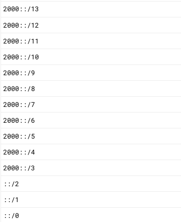

<style
  type="text/css">
section.lead.large h1 {
  font-size: 200%
}
/* section.answer > * {
  display: none !important;
}

section.answer > div {
  display: none;
} */

/* section.answer::before {
  content: 'ANSWER DURING THE SHOW';
  color: silver;
  z-index: 10000;
  font-size: 60pt;
  display: block !important;
  transform: translate(40pt, 160pt) rotate(30deg);
} */
</style>
<style
  type="text/css">
/* cyrillic-ext */
@font-face {
  font-family: 'Fira Mono';
  font-style: normal;
  font-weight: 400;
  src: url(https://fonts.gstatic.com/s/firamono/v14/N0bX2SlFPv1weGeLZDtgK_7Ss9XZYalI.woff2) format('woff2');
  unicode-range: U+0460-052F, U+1C80-1C88, U+20B4, U+2DE0-2DFF, U+A640-A69F, U+FE2E-FE2F;
}
/* cyrillic */
@font-face {
  font-family: 'Fira Mono';
  font-style: normal;
  font-weight: 400;
  src: url(https://fonts.gstatic.com/s/firamono/v14/N0bX2SlFPv1weGeLZDtgIv7Ss9XZYalI.woff2) format('woff2');
  unicode-range: U+0301, U+0400-045F, U+0490-0491, U+04B0-04B1, U+2116;
}
/* greek-ext */
@font-face {
  font-family: 'Fira Mono';
  font-style: normal;
  font-weight: 400;
  src: url(https://fonts.gstatic.com/s/firamono/v14/N0bX2SlFPv1weGeLZDtgKv7Ss9XZYalI.woff2) format('woff2');
  unicode-range: U+1F00-1FFF;
}
/* greek */
@font-face {
  font-family: 'Fira Mono';
  font-style: normal;
  font-weight: 400;
  src: url(https://fonts.gstatic.com/s/firamono/v14/N0bX2SlFPv1weGeLZDtgJf7Ss9XZYalI.woff2) format('woff2');
  unicode-range: U+0370-0377, U+037A-037F, U+0384-038A, U+038C, U+038E-03A1, U+03A3-03FF;
}
/* latin-ext */
@font-face {
  font-family: 'Fira Mono';
  font-style: normal;
  font-weight: 400;
  src: url(https://fonts.gstatic.com/s/firamono/v14/N0bX2SlFPv1weGeLZDtgKP7Ss9XZYalI.woff2) format('woff2');
  unicode-range: U+0100-02AF, U+0304, U+0308, U+0329, U+1E00-1E9F, U+1EF2-1EFF, U+2020, U+20A0-20AB, U+20AD-20C0, U+2113, U+2C60-2C7F, U+A720-A7FF;
}
/* latin */
@font-face {
  font-family: 'Fira Mono';
  font-style: normal;
  font-weight: 400;
  src: url(https://fonts.gstatic.com/s/firamono/v14/N0bX2SlFPv1weGeLZDtgJv7Ss9XZYQ.woff2) format('woff2');
  unicode-range: U+0000-00FF, U+0131, U+0152-0153, U+02BB-02BC, U+02C6, U+02DA, U+02DC, U+0304, U+0308, U+0329, U+2000-206F, U+2074, U+20AC, U+2122, U+2191, U+2193, U+2212, U+2215, U+FEFF, U+FFFD;
}
/* cyrillic-ext */
@font-face {
  font-family: 'Fira Mono';
  font-style: normal;
  font-weight: 500;
  src: url(https://fonts.gstatic.com/s/firamono/v14/N0bS2SlFPv1weGeLZDto1d3Hk_fUS5NBBASF.woff2) format('woff2');
  unicode-range: U+0460-052F, U+1C80-1C88, U+20B4, U+2DE0-2DFF, U+A640-A69F, U+FE2E-FE2F;
}
/* cyrillic */
@font-face {
  font-family: 'Fira Mono';
  font-style: normal;
  font-weight: 500;
  src: url(https://fonts.gstatic.com/s/firamono/v14/N0bS2SlFPv1weGeLZDto1d3HmvfUS5NBBASF.woff2) format('woff2');
  unicode-range: U+0301, U+0400-045F, U+0490-0491, U+04B0-04B1, U+2116;
}
/* greek-ext */
@font-face {
  font-family: 'Fira Mono';
  font-style: normal;
  font-weight: 500;
  src: url(https://fonts.gstatic.com/s/firamono/v14/N0bS2SlFPv1weGeLZDto1d3HkvfUS5NBBASF.woff2) format('woff2');
  unicode-range: U+1F00-1FFF;
}
/* greek */
@font-face {
  font-family: 'Fira Mono';
  font-style: normal;
  font-weight: 500;
  src: url(https://fonts.gstatic.com/s/firamono/v14/N0bS2SlFPv1weGeLZDto1d3HnffUS5NBBASF.woff2) format('woff2');
  unicode-range: U+0370-0377, U+037A-037F, U+0384-038A, U+038C, U+038E-03A1, U+03A3-03FF;
}
/* latin-ext */
@font-face {
  font-family: 'Fira Mono';
  font-style: normal;
  font-weight: 500;
  src: url(https://fonts.gstatic.com/s/firamono/v14/N0bS2SlFPv1weGeLZDto1d3HkPfUS5NBBASF.woff2) format('woff2');
  unicode-range: U+0100-02AF, U+0304, U+0308, U+0329, U+1E00-1E9F, U+1EF2-1EFF, U+2020, U+20A0-20AB, U+20AD-20C0, U+2113, U+2C60-2C7F, U+A720-A7FF;
}
/* latin */
@font-face {
  font-family: 'Fira Mono';
  font-style: normal;
  font-weight: 500;
  src: url(https://fonts.gstatic.com/s/firamono/v14/N0bS2SlFPv1weGeLZDto1d3HnvfUS5NBBA.woff2) format('woff2');
  unicode-range: U+0000-00FF, U+0131, U+0152-0153, U+02BB-02BC, U+02C6, U+02DA, U+02DC, U+0304, U+0308, U+0329, U+2000-206F, U+2074, U+20AC, U+2122, U+2191, U+2193, U+2212, U+2215, U+FEFF, U+FFFD;
}
/* cyrillic-ext */
@font-face {
  font-family: 'Fira Mono';
  font-style: normal;
  font-weight: 700;
  src: url(https://fonts.gstatic.com/s/firamono/v14/N0bS2SlFPv1weGeLZDtondvHk_fUS5NBBASF.woff2) format('woff2');
  unicode-range: U+0460-052F, U+1C80-1C88, U+20B4, U+2DE0-2DFF, U+A640-A69F, U+FE2E-FE2F;
}
/* cyrillic */
@font-face {
  font-family: 'Fira Mono';
  font-style: normal;
  font-weight: 700;
  src: url(https://fonts.gstatic.com/s/firamono/v14/N0bS2SlFPv1weGeLZDtondvHmvfUS5NBBASF.woff2) format('woff2');
  unicode-range: U+0301, U+0400-045F, U+0490-0491, U+04B0-04B1, U+2116;
}
/* greek-ext */
@font-face {
  font-family: 'Fira Mono';
  font-style: normal;
  font-weight: 700;
  src: url(https://fonts.gstatic.com/s/firamono/v14/N0bS2SlFPv1weGeLZDtondvHkvfUS5NBBASF.woff2) format('woff2');
  unicode-range: U+1F00-1FFF;
}
/* greek */
@font-face {
  font-family: 'Fira Mono';
  font-style: normal;
  font-weight: 700;
  src: url(https://fonts.gstatic.com/s/firamono/v14/N0bS2SlFPv1weGeLZDtondvHnffUS5NBBASF.woff2) format('woff2');
  unicode-range: U+0370-0377, U+037A-037F, U+0384-038A, U+038C, U+038E-03A1, U+03A3-03FF;
}
/* latin-ext */
@font-face {
  font-family: 'Fira Mono';
  font-style: normal;
  font-weight: 700;
  src: url(https://fonts.gstatic.com/s/firamono/v14/N0bS2SlFPv1weGeLZDtondvHkPfUS5NBBASF.woff2) format('woff2');
  unicode-range: U+0100-02AF, U+0304, U+0308, U+0329, U+1E00-1E9F, U+1EF2-1EFF, U+2020, U+20A0-20AB, U+20AD-20C0, U+2113, U+2C60-2C7F, U+A720-A7FF;
}
/* latin */
@font-face {
  font-family: 'Fira Mono';
  font-style: normal;
  font-weight: 700;
  src: url(https://fonts.gstatic.com/s/firamono/v14/N0bS2SlFPv1weGeLZDtondvHnvfUS5NBBA.woff2) format('woff2');
  unicode-range: U+0000-00FF, U+0131, U+0152-0153, U+02BB-02BC, U+02C6, U+02DA, U+02DC, U+0304, U+0308, U+0329, U+2000-206F, U+2074, U+20AC, U+2122, U+2191, U+2193, U+2212, U+2215, U+FEFF, U+FFFD;
}
pre > *, code > *, pre, code {
  font-family: "Fira Mono" !important;
}
section.lead.large h1 {
  font-size: 200%
}
/* section.answer > * {
  display: none
} */

section.smaller-table table {
  font-size: 80%;
}
section.smaller2x-table table {
  font-size: 60%;
}
section.smaller-86p > p {
  font-size: 86%;
}
section.smaller-86p > h2
{
  font-size: 125%;
}
</style>

# On IPs 2.1

<!-- We are going to spend most of our time today on IP ranges -->

- Binary numbers from scratch
- Subnet Mask
- CIDRs
- Storing IPs in databses

---

<!-- _class: lead -->
# Binary number system

## For non-CS people

---

# It's all about language 
ChatGPT is a large *language* model. LLM

## Let's imagine an alphabet with only two letters:  `A`, `B`

Using our two-letter alphabet,
We crate **languages** with **fixed-length words**. Meaning all words in our languages have exactly the same length. 

---

### In a language with words that are **exactly one letter long**, how many distinct words  be made with this alphabet of `A`, `B`❓
    
---

<!-- _class: answer -->
### In a language with words that are **exactly one-letter long**, how many distinct words can be made with this alphabet of `A`, `B`❓

|    |
|--- |
| A |
| B |

2 words

---

<!-- _class: no-answer -->

### In a language with words that are **exactly two-letter long**, how many words can be made with this alphabet of `A`, `B`❓

---

<!-- _class: answer -->
### In a language with words that are **exactly two-letter long**, how many words can be made with this alphabet of `A`, `B`❓
    

|    |    |
|--- |--- |
| AA | BA |
| AB | BB |


2 x 2 = 4 words

---

<!-- _class: no-answer -->

### In a language with words that are **exactly three-letter long**, how many words can be made with this alphabet of `A`, `B`❓

---

<!-- _class: answer -->
### In a language with words that are **exactly three-letter long**, how many words can be made with this alphabet of `A`, `B`❓
    

|     |     |  
| --- | --- |  
| AAA | ABA |  
| AAB | ABB |  

|     |     |
| --- | --- |
| BAA | BBA |
| BAB | BBB |

2 x 2 x 2 = 8 words


---

<!-- _class: no-answer -->
### In a language with words that are **exactly four-letter long**, how many words can be made with this alphabet of `A`, `B`❓
    

2 x 2 x 2 x 2 = 16 words


Each time we increase the lenght of our language by one, we have twice as many words.

---

<!-- _class: lead -->
Powers of 2
    
$$
\begin{array}{cc}
& 2^1 & = & 2 \\ \
& 2^2 & = & 4 \\ \
& 2^3 & = & 8 \\ \
& 2^4 & = & 16 \\ \
& & ...
\end{array}
$$

---

The words in these languages have a natural sorting order. 
Exatly Like in a normal dictionary:
  
```sql
Language of Length 1 = A , B 
Language of Length 2 = AA , AB , BA , BB
Language of Length 3 = AAA , AAB , ... , BBB
Language of Length 4 = AAAA , ... , BBBB
```

---

Now instead of representing words with letters, we use 0 and 1:

```sql
A = 0
B = 1
```

One-letter word language:
```sql
A , B
0 , 1 (2^1 - 1)
```

Two-letter word language:
```sql
AA , AB , BA , BB
00 , 01 , 10 , 11
0  , 1  , 2  , 3 (2^2 - 1)
```

---

Three-letter word language:
```sql
AAA , AAB , ABA , ABB , BAA , BAB , BBA , BBB 
000 , 001 , 010 , 011 , 100 , 101 , 110 , 111
0   ,  1  ,  2  ,  3  ,  4  ,  5  ,  6  ,  7 (2^3 - 1)
```

Four-letter word language:
```sql
AAAA , ... , BBBB
0000 , ... , 1111
0    , ... , 15 (2^4 - 1)
```

Note that we always ended up with a number that is  2 to the power of the length of the word minus one.


---

IPv4 addresses are numbers (from 0 to `4,294,967,296 - 1`)
Where does `4,294,967,296 - 1`  come from?

$$
2^{32}-1
$$

It's a language of fixed-size 32-letter words 
(with alphabet of 0 and 1).

---

Example of a 32-letter "word":

```bash
0100011000100101001110001000010
```

We call each letter (0 and 1) a bit.
We put a space between every 8 bits.

```bash
01000110 00100101 0011100 01000010
```

Each segment is a byte.

IPv4 is made of 4 bytes.

It is also a whole number (integer). Restricted to maximum 4 bytes.

---


4-byte integers
        
```bash
00000000 00000000 00000000 00000000 = 0
00000000 00000000 00000000 00000001 = 1 = 2^1
00000000 00000000 00000000 00000010 = 2 = 2^2
00000000 00000000 00000000 00000011 = 3 = 2^4 - 1
00000000 00000000 00000000 00000100 = 4 = 2^4
00000000 00000000 00000000 00000101 = 5
00000000 00000000 00000000 00000110 = 6
00000000 00000000 00000000 00000111 = 7 = 2^3 - 1
00000000 00000000 00000000 00001000 = 8 = 2^3
...
00000000 00000000 00000000 01111111     = 2^7 - 1
00000000 00000000 00000000 10000000     = 2^7
00000000 00000000 00000000 10000001     = 2^7 + 1
00000000 00000000 00000000 10000010     = 2^7 + 2
00000000 00000000 00000000 10000011     = 2^7 + 3
...
00000000 00000000 00000000 11111111     = 2^8 - 1
00000000 00000000 00000001 00000000     = 2^8
...
00000000 00000000 10000000 00000000     = 2^15
...
00000000 00000000 11111111 11111111     = 2^16 - 1
00000000 00000001 00000000 00000000     = 2^16
...
10000000 00000000 00000000 00000000     = 2^31
10000000 00000000 00000000 00000001     = 2^31 + 1
...
10000000 00000000 00000000 10000000     = 2^31 + 2^7
...
11111111 11111111 11111111 11111111     = 2^32 - 1
```

---
<!-- _class: lead -->
$$
\begin{array}{cccccc}
01000110 & . & 00100101 & . & 0011100 & . & 01000010 \\
  70     & . &    37    & . &    28   & . &    66    \\
\end{array}
$$

---

# Binary Operations

## Addition 

  - 0 + 0 = 0
  - 0 + 1 = 1
  - 1 + 0 = 1
  - 1 + 1 = 10 (with a carry of 1)

---

For example, let's add the binary numbers 1011 and 1010:

<!-- _class: lead -->
$$
\begin{array}{r}
\phantom{+} & \phantom{1} & \phantom{1} & \phantom{1} & \phantom{1} \\
\phantom{+} & & & 1 & 0 & 1 & 1 \\
+ & & & 1 & 0 & 1 & 0 \\
\hline
\phantom{+} & & & & & & 1 \\
\end{array}
$$

---

<!-- _class: lead -->
$$
\begin{array}{r}
\phantom{+} & \phantom{1} & \phantom{1} & \phantom{0} & 1 & \phantom{1} & \phantom{1} \\
\phantom{+} & & & 1 & 0 & 1 & 1 \\
+ & & & 1 & 0 & 1 & 0 \\
\hline
\phantom{+} & & & & & 0 & 1 \\
\end{array}
$$
---

<!-- _class: lead -->
$$
\begin{array}{r}
\phantom{+} & \phantom{1} & \phantom{1} & \phantom{0} & 1 & \phantom{1} & \phantom{1} \\
\phantom{+} & & & 1 & 0 & 1 & 1 \\
+ & & & 1 & 0 & 1 & 0 \\
\hline
\phantom{+} & & & & 1 & 0 & 1 \\
\end{array}
$$

---

<!-- _class: lead -->
$$
\begin{array}{r}
\phantom{+} & \phantom{1} & 1 & \phantom{1} & 1 & \phantom{0} & \phantom{1} & \phantom{1} \\
\phantom{+} & & & 1 & 0 & 1 & 1 \\
+ & & & 1 & 0 & 1 & 0 \\
\hline
\phantom{+} & & & 0 & 1 & 0 & 1 \\
\end{array}
$$

---

<!-- _class: lead -->
$$
\begin{array}{r}
\phantom{+} & \phantom{1} & 1 & \phantom{1} & 1 & \phantom{0} & \phantom{1} & \phantom{1} \\
\phantom{+} & & & 1 & 0 & 1 & 1 \\
+ & & & 1 & 0 & 1 & 0 \\
\hline
\phantom{+} & & 1 & 0 & 1 & 0 & 1 \\
\end{array}
$$

&nbsp;

Do you see a bug ❓

---

<!-- _class: lead answer -->
$$
\begin{array}{r}
\phantom{+} & \phantom{1} & 1 & \phantom{1} & 1 & \phantom{0} & \phantom{1} & \phantom{1} \\
\phantom{+} & & & 1 & 0 & 1 & 1 \\
+ & & & 1 & 0 & 1 & 0 \\
\hline
\phantom{+} & & \cancel{1} & 0 & 1 & 0 & 1 \\
\\ \ \\
\end{array}
$$

$$
\begin{array}{r}
1011 & + & 1010 & = & \cancel{1}0101  \\
11 & + & 10 & = & 21 \ (5)
\end{array}
$$


Congratulations!

---

<!-- _class: no-answer -->

## Substraction 

- 0 - 0 = 0
- 1 - 0 = 1
- 1 - 1 = 0
- 0 - 1 = ❓

&nbsp;

No negative numbers

---

<!-- _class: lead -->
$$
\begin{array}{r}
& 1 & 1 & 0 & 1 \ \\
	-	& 1 & 0 & 1 & 0 \
\\
\hline 
\\
= & ?
\end{array}
$$

---
<!-- _class: lead -->

$$
\begin{array}{r}
& 1 & 1 & 0 & 1 \ \\
	-	& 1 & 0 & 1 & 0 \
\\
\hline 
\\
= & & & & 1
\end{array}
$$

---

<!-- _class: lead -->

$0 - 1$ requires borrowing:
$10 - 1 = 1$

&nbsp;

$$
\begin{array}{r}
&   & 0 & 10 &  \ \\
& 1 & \cancel{1} & 0 & 1 \ \\
	-	  & 1 & 0 & 1 & 0 \
\\
\hline 
\\
&   &   & 1 & 1 \
\end{array}
$$

---

<!-- _class: lead -->
$$
\begin{array}{r}
&   & 0 & 10 &  \ \\
& 1 & \cancel{1} & 0 & 1 \ \\
	-	  & 1 & 0 & 1 & 0 \
\\
\hline 
\\
&   & 0 & 1 & 1 \
\end{array}
$$

---
<!-- _class: lead -->
$$
\begin{array}{r}
&   & 0 & 10 &  \ \\
& 1 & \cancel{1} & 0 & 1 \ \\
	-	  & 1 & 0 & 1 & 0 \
\\
\hline 
\\
& 0 & 0 & 1 & 1 \
\end{array}
$$

&nbsp;

$$
\begin{array}{r}
1101 & - & 1010 & = & 0011  \\
13 & - & 10 & = & 3
\end{array}
$$

---
## Bitwise OR ($|$ or $\lor$)

$$
\begin{array}{ccc}
1 & \lor & 1 & = & 1 \\
1 & \lor & 0 & = & 1 \\
0 & \lor & 1 & = & 1 \\
0 & \lor & 0 & = & 0 \\
\end{array}
$$

---

## Bitwise AND ($\&$ or $\land$)

$$
\begin{array}{ccc}
1 & \land & 1 & = & 1 \\
1 & \land & 0 & = & 0 \\
0 & \land & 1 & = & 0 \\
0 & \land & 0 & = & 0 \\
\end{array}
$$

---

Example ❓

$$
\begin{array}{ccc}
168 & = & 10101000 \\
\land \\
0 & = & 00000000 \\
\\
\hline 
\\
 & = & ?
\end{array}
$$

---

<!-- _class: answer -->

Example ✅

$$
\begin{array}{ccc}
168 & = & 10101000 \\
\land \\
0 & = & 00000000 \\
\\
\hline 
\\
 0 & = & 00000000
\end{array}
$$

---

<!-- _class: no-answer -->

Example ❓

$$
\begin{array}{ccc}
168 & = & 10101000 \\
\land \\
1 & = & 11111111 \\
\\
\hline 
\\
  & = & ?
\end{array}
$$

---

<!-- _class: answer -->

Example ✅

$$
\begin{array}{ccc}
168 & = & 10101000 \\
\land \\
1 & = & 11111111 \\
\\
\hline 
\\
 168 & = & 10101000
\end{array}
$$

---
<!-- _class: no-answer -->

Example ❓

$$
\begin{array}{ccc}
168 & = & 10101000 \\
\land \\
53 & = & 00110101 \\
\\
\hline 
\\
  & = & ?
\end{array}
$$

---
<!-- _class: answer -->
Example ✅

$$
\begin{array}{ccc}
168 & = & 10101000 \\
\land \\
53 & = & 00110101 \\
\\
\hline 
\\
 32 & = & 00100000
\end{array}
$$

---

<!-- _class: no-answer -->

Example ❓

$$
\begin{array}{ccc}
168 & = & 10101000 \\
\land \\
168 & = & 10101000 \\
\\
\hline 
\\
  & = & ?
\end{array}
$$

---

<!-- _class: answer -->
Example ✅

$$
\begin{array}{ccc}
168 & = & 10101000 \\
\land \\
168 & = & 10101000 \\
\\
\hline 
\\
168 & = & 10101000 
\end{array}
$$

---

<!-- _class: no-answer -->

### Now with IPv4s ❓

$$
\begin{array}{cccccc}
192.168.5.117 & = & 11000000 & . & 10101000 & . & 00000101 & . & 01110101 \\
\land \\
255.255.248.0 & = & 11111111 & . & 11111111 & . & 11111000 & . & 00000000 \\
\\
\hline 
\\
 & = &  & . &  & . &  & . & ? \\
\end{array}
$$


---
<!-- _class: answer -->
### Now with IPv4s ✅

$$
\begin{array}{cccccc}
192.168.5.117 & = & 11000000 & . & 10101000 & . & 00000101 & . & 01110101 \\
\land \\
255.255.248.0 & = & 11111111 & . & 11111111 & . & 11111000 & . & 00000000 \\
\\
\hline 
\\
192.168.0.0 & = & 11000000 & . & 10101000 & . & 00000000 & . & 00000000 \\
\end{array}
$$

---

<!-- _class: no-answer -->

## Bitwise NOT ($\sim$ or $\neg$)

$$
\begin{array}{cc}
\\
\neg 1 & = & 0 \\ \\
\neg 0 & = & 1 \
\end{array}
$$

---

Example ❓

$$
\begin{array}{cc}
\\
\neg \ & 10101000 \\ \\
\hline
\\
= & ?
\end{array}
$$

---
<!-- _class: answer -->
Example ✅

$$
\begin{array}{cc}
\\
\neg \ & 10101000 \\ \\
\hline
\\
= & 01010111 
\end{array}
$$

---

<!-- _class: no-answer -->
Example 

$$
\begin{array}{ccccc}
\neg \ & 255 & . & 255 & . & 248 & . & 0 \\
\hline
= & 0 & . & 0 & . & 7 & . & 255
\end{array}
$$

$$
\begin{array}{cccccc}
\\
\neg & 11111111 & . & 11111111 & . & 11111000 & . & 00000000  \\
\hline
= & 00000000 & . & 00000000 & . & 00000111 & . & 11111111
\\ \\ \\
\end{array}
$$

- Note that 7 + 248 = 255

---


---

## Subnet Mask
- Identifies which part of the IP address corresponds to the network and which part corresponds to the hosts (devices) within that network.

```
    11000000.10101000.00000101.01110101   IP Address     : 192.168.5.117
AND 11111111.11111111.11111000.00000000   Subnet Mask    : 255.255.248.0
-------------------------------------------------------------------------
    11000000.10101000.00000000.00000000   Network Address: 192.168.0.0
```

---

## Subnet Mask
- Identifies the size of the network:

```
11111111.11111111.11111000.00000000
```

Leading bits with 1 are fixed.
Trailing bits with 0 can be assigned to devices in the network.

What's the size of this networ ❓

---
## Subnet Mask → Size of network

```
11111111.11111111.11111000.00000000
```

Count 0s from right: 8 + 3 = 11

$2^{11} = 2048$

Technically last IP address is reserved for broadcast. And the first is for representing the nework. So the actual size is two less than this. Technicality.

---

```
11111111.11111111.11111000.00000000
```

Count 0s from right: $8 + 3 = 11$

Count 1s from left and subtract it from 32: 
$32 - (8 + 8 + 5) = 32 - 21 = 11$

$2^{11} = 2048$

Remember CIDRs?

---

# CIDR

```
5.31.128.0/18
```

Network: `5.31.128.0`
Prefix: `18`

Why is it called prefix ❓

---
## CIDR

```
5.31.128.0/18
```

18 is the number of leading fixed bits.


```
5.31.128.0     = 00000101.00011111.10000000.00000000
255.255.192.0  = 11111111.11111111.11000000.00000000  (/18)
```

What is the size of this network❓

---

## CIDR Size

```
5.31.128.0/18
```

$2^{32-18}=2^{14} = 16,384$

18 = Count if leading fixed 1s:
14 = Count of of trailing 0s:s

```
/18 = 11111111.11111111.11000000.00000000
```

Leading fixed 1s are fixed!
Each trailing 0 can be either 0 or 1.

---

If we had only one trailing 0: 

```
/31 = 11111111.11111111.11111111.11111110
```

it could have been set either 0 or 1. = $2^1$

---

If we had only two trailign 0s 

```
/30 = 11111111.11111111.11111111.11111100
```

They could have been set to one of these:

```
00
01
10
11
```

Or $2^2$ arrangements

---

If we had only three trailign 0s 

```
/29 = 11111111.11111111.11111111.11111000
```

They could have been set to one of these:

```
000  010  100  110
001  011  101  111
```

Or $2^3$ arrangements

---

Hence the size of the network =

$$2^{\text{Number of trailing 0s}}$$

Or

$$2^{\text{32 - Number of leading 1s}}$$


$\text{}$

```
/18 = 11111111.11111111.11000000.00000000
```

---

# IPv6 Binary

```
2001:0db8:85a3:0000:0000:8a2e:0370:7334
= 0010000000000001:0000110110111000:1000010110100011:0000000000000000
  0000000000000000:1000101000101110:0000001101110000:0111001100110100
```

- Separated by `:`
- Each segment is made of 16 bits (IPv4 segments were made of 8 bits)

---

| IPv6 Segment            | Binary Representation                          |
|-------------------------|------------------------------------------------|
| 2001                    | 0010000000000001                               |
| 0db8                    | 0000110110111000                               |
| 85a3                    | 1000010110100011                               |
| 0000                    | 0000000000000000                               |
| 0000                    | 0000000000000000                               |
| 8a2e                    | 1000101000101110                               |
| 0370                    | 0000001101110000                               |
| 7334                    | 0111001100110100                               |

---

<!-- _class: lead -->
### What is the advantage of 16-bit segments ❓

```
       2001        :       0db8       :    ...
= 0010000000000001 : 0000110110111000 :    ...
```

---

# Hexadecimal numbers

- The alphabet of binary numbers contains only `0` and `1`
- The alphabet of decimal numbers contains `0`, `1`, `2`, ..., `9`
- The alphabet of hexadecimal numbers contains `0`, `1`, `2`, ..., `9`, `A`, `B`, `C`, `D`, `E`, `F`


Example: RGB colors

---


---

<!-- _class: lead -->
### How many unique RGB colors exist? ❓


---

- Components: Red, Green, Blue
- Value Range: 0 to 255 (Decimal), 00 to FF (Hexadecimal)

| Component | Decimal Range  | Hex Range     |
|-----------|----------------|---------------|
| Red       | 0 to 255       | 00 to FF      |
| Green     | 0 to 255       | 00 to FF      |
| Blue      | 0 to 255       | 00 to FF      |

&nbsp;
Total Colors: $256^3 = 16,777,216$

---

## IPv6 CIDRs

```
2001:0db8:85a3:a39d:0000:0000:0000:0000/64
```
<!-- _class: smaller2x-table -->
Means the first 64 bits are fixed.

| Hex CIDR | Binary CIDR             | Binary Mask            | Hex Result |
|----------|-------------------------|------------------------|------------|
| 2001     | 0010000000000001        | 1111111111111111       | 2001       |
| 0db8     | 0000110110111000        | 1111111111111111       | 0db8       |
| 85a3     | 1000010110100011        | 1111111111111111       | 85a3       |
| a39d     | 1010001110011101        | 1111111111111111       | a39d       |
| 0000     | 0000000000000000        | 0000000000000000       | 0000       |
| 0000     | 0000000000000000        | 0000000000000000       | 0000       |
| 0000     | 0000000000000000        | 0000000000000000       | 0000       |
| 0000     | 0000000000000000        | 0000000000000000       | 0000       |

---

## Significant Bits

<!-- _class: smaller-86p -->
Significant bits are determined by CIDR prefix. `/25` means 25 significant bits.

All these represent the same CIDR:

```
    188.88.191.128/25 = 10111100.01011000.10111111.10000000 /25
    188.88.191.164/25 = 10111100.01011000.10111111.10100100 /25
    188.88.191.151/25 = 10111100.01011000.10111111.10010111 /25
    188.88.191.255/25 = 10111100.01011000.10111111.11111111 /25
AND /25               = 11111111.11111111.11111111.10000000
-----------------------------------------------------------------
=   188.88.191.128/25 = 10111100.01011000.10111111.10000000
```

Because `AND`ing them with `/25` mask returns the same result.

---

## How to check if an IP belongs to a CIDR:

$$
\text{IP} \land \text{CIDR} = \text{CIDR}
$$

We can do this operation for the whole IP at once, bit per bit or segment per segment.

<!-- _class: smaller-table -->
|                          | Segment 1         | Segment 2         | Segment 3         | Segment 4         |
|--------------------------|-------------------|-------------------|-------------------|-------------------|
| CIDR Segment (Decimal)   | 188               | 88                | 188               | 0                 |
| IP Segment (Decimal)     | 188               | 88                | 191               | 53                |
| CIDR Segment (Binary)    | 10111100          | 01011000          | 10111100          | 00000000          |
| IP Segment (Binary)      | 10111100          | 01011000          | 10111111          | 00110101          |
| Bitwise AND              | 10111100          | 01011000          | 10111100          | 00000000          |

---

Counter example:

<!-- _class: smaller-table -->
|                          | Segment 1         | Segment 2         | Segment 3         | Segment 4         |
|--------------------------|-------------------|-------------------|-------------------|-------------------|
| CIDR Segment (Decimal)   | 188               | 88                | 188               | 0                 |
| IP Segment (Decimal)     | 188               | 88                | 185               | 102               |
| CIDR Segment (Binary)    | 10111100          | 01011000          | 10111100          | 00000000          |
| IP Segment (Binary)      | 10111100          | 01011000          | 10111001          | 01100110          |
| Bitwise AND?             | 10111100          | 0101100           | 10111000          | 00000000          |
| ANDing Equals CIDR?      |                   |                   | Different!        |                   |

---

Same for IPv6
```
2001:8f8:1f26:0:800:f66c:9a2f:6913
2001:8f8:1f26::/64
```

<!-- _class: smaller-table -->
|                           | CIDR Segment | IP Segment | Bitwise AND      |
|---------------------------|--------------|------------|------------------|
| Segment 1                 | 2001         | 2001       | 2001             |
| Segment 2                 | 08f8         | 08f8       | 08f8             |
| Segment 3                 | 1f26         | 1f26       | 1f26             |
| Segment 4                 | 0000         | 0000       | 0000             |
| Segment 5                 | 0000         | 0800       | 0000             |
| Segment 6                 | 0000         | f66c       | 0000             |
| Segment 7                 | 0000         | 9a2f       | 0000             |
| Segment 8                 | 0000         | 6913       | 0000             |

---

## Parent

How to find the Parent of a CIDR:
```
   188.88.191.128/25 = 10111100.01011000.10111111.10000000
   /25               = 11111111.11111111.11111111.10000000
```
One less fixed leading 1:

```
    188.88.191.128/25 = 10111100.01011000.10111111.10000000
AND /24               = 11111111.11111111.11111111.00000000
-------------------------------------------------------------
=   188.88.191.0/24   = 10111100.01011000.10111111.00000000
```

---

Note that the rigth most siginifcant bit was 1:
```
    188.88.191.128/25 = 10111100.01011000.10111111.10000000
AND /24               = 11111111.11111111.11111111.00000000
-------------------------------------------------------------
=   188.88.191.0/24   = 10111100.01011000.10111111.00000000
```

But here the right most significant bit is 0:
```
    188.88.191.0/25   = 10111100.01011000.10111111.00000000
AND /24               = 11111111.11111111.11111111.00000000
-------------------------------------------------------------
=   188.88.191.0/24   = 10111100.01011000.10111111.00000000
```

---

## Finding the immidiate parent of a CIDR:

$$
\text{CIDR} \land \text{Mask of CIDR prefix - 1} \\ \ \\
\text{CIDR} \land \text{CIDR} - 1
$$

```
    188.88.191.128/25 = 10111100.01011000.10111111.10000000
AND 188.88.191.127    = 11111111.11111111.11111111.01111111   (minus one)
-------------------------------------------------------------
=   188.88.191.0/24   = 10111100.01011000.10111111.00000000
```

&nbsp;
Another trick, same result.

---

IPv6 Example:

```
     2001:8f8:1f26:0:800:c000::/82
```

```
     2001:8f8:1f26:0:800:c000/82 - 1
=    2001:8f8:1f26:0:800:bfff
```

```
     2001:8f8:1f26:0:800:c000/82 - 1
AND  2001:8f8:1f26:0:800:bfff
-------------------------------------
=    2001:8f8:1f26:0:800:8000/81
```

JS: `(0xc000 & (0xc000 - 1)).toString(16)`
Python: `hex(0xc000 & (0xc000 - 1))`
PHP: `dechex(0xc000 & (0xc000 - 1))`

---

# Storing IPs in databases

- Why not `TEXT`❓
- PostgreSQL natively [supports](https://www.postgresql.org/docs/current/datatype-net-types.html) `INET` and `CIDR` types.
- Redshift does not. 
  - IPv4 (32 bits) fits in four bytes `INTEGER` type.
  - IPv6 (128 bits) does not fit even in eight byte `BIGINT` type.
  - Ideas❓

--- 

<!-- _class: smaller-table smaller-86p -->
## Redshift Datatypes

| Type        | Type       | Type       |
|-------------|------------|------------|
| SMALLINT    | TIME       | BOOLEAN    |
| INTEGER     | TIMETZ     | HLLSKETCH  |
| BIGINT      | TIMESTAMP  | SUPER      |
| DECIMAL     | TIMESTAMPTZ| VARBYTE    |
| REAL        | INTERVAL   | GEOMETRY   |
| DOUBLE      | INTERVAL   | GEOGRAPHY  |
| CHAR        | DATE       |            |
| VARCHAR     |            |            |

[Reference](https://docs.aws.amazon.com/redshift/latest/dg/c_Supported_data_types.html)


---

<!-- _class: answer -->

#### 1. DECIMAL(38, 0)
> 128-bit signed integers with up to 38 digits of precision.

Last IPv6 = `4254067007947694999765325593992438811` exactly 38 digits.

But

```sql
SELECT '37271623303817'::decimal(38, 0) & '28182172393344'::decimal(38, 0)
```

> Error: operator does not exist: numeric & numeric

---

<!-- _class: answer -->

#### 2. Signed eight-byte integer: split IPv6 into two columns of `BIGINT`

```
2001:8f8:1f26::f66c:9a2f:6913
```

Adding leading 0s...

```
2001:08f8:1f26:0000:0800:f66c:9a2f:6913
```


```sql
select 
  x'200108f81f260000' :: bigint as left
, x'0800f66c9a2f6913' :: bigint as right
```

---

<!-- _class: no-answer -->

Getting all CIDRs that an INET (IP address) belongs to

```sql
with recursive r as (
    select cidr '2001:8f8:1f26:0:800:f66c:9a2f:6913/128' as cidr
    union 
    select set_masklen(cidr, masklen(cidr) - 1) from r
    where masklen(cidr) > 0
)
select * from r order by masklen(cidr) desc;
```
---




---

💡 An IPv4 address belongs to maximum 32 CIDRs
💡 An IPv6 address belongs to maximum 128 CIDRs

---

# Set Theory

---

## Complement Range

---

## IP Exclusion

---

## Recursive Tree Algorithms

---

# Binary Search Tree

```sql
CREATE FUNCTION cidr_get_complement(p_nodes cidr[], p_original_nodes cidr[]) RETURNS SETOF cidr
  IMMUTABLE
  PARALLEL SAFE
  LANGUAGE plpgsql
AS
$$
  BEGIN
    RAISE NOTICE '%, %', cardinality(p_nodes), p_nodes;
    IF cardinality(p_nodes) = 0 then
      RAISE NOTICE '%, %', cardinality(p_nodes), 'END!!';
      return query select * from (values (null::cidr)) t where FALSE;
    else
      return query with nodes as (
        SELECT n.n as node from unnest(p_nodes) n
      )
      , original_nodes as (
        select n.n as node from unnest(p_original_nodes) n
      )
      , siblings as (
        select DISTINCT cidr_get_sibling(nodes.node) as sibling
        from nodes
        where not exists(select * from nodes n where cidr_get_sibling(nodes.node) >>= n.node)
      )
      , parents as (
        select DISTINCT case when masklen(nodes.node) > 0 then set_masklen(nodes.node, masklen(nodes.node) - 1) end as parent from nodes
      )
      SELECT siblings.sibling as node
      from siblings
      where siblings.sibling is not null
        and not exists(select * from nodes where siblings.sibling >>= nodes.node)
        and not exists(select * from original_nodes where siblings.sibling >>= original_nodes.node)
      union
      select * from cidr_get_complement(array(select parents.parent from parents where parents.parent is not null), p_original_nodes)
      ;
    END IF;
  END;
$$;
```

---